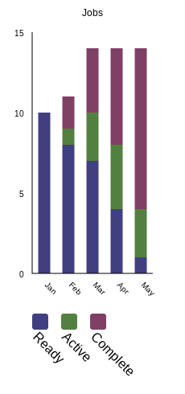

# Stacked Bar Chart

This is a stacked bar chart generator.  You provide a [JSON5](https://json5.org/) file with data and it generates an SVG file.  You can convert the SVG to PNG or other bitmap formats with the [resvg](https://crates.io/crates/resvg) tool.

Here is an example of the output:

Install with `cargo install stacked_bar_chart`.  Run with `stacked-bar-chart`.

Features of the tool include:

- Automatic scaling of the Y axis labels
- Automatic generation of the legend
- Automatic selection of bar colors to maximize contrast
- Uses SVG classes to enable easy changes to the generate graphs
